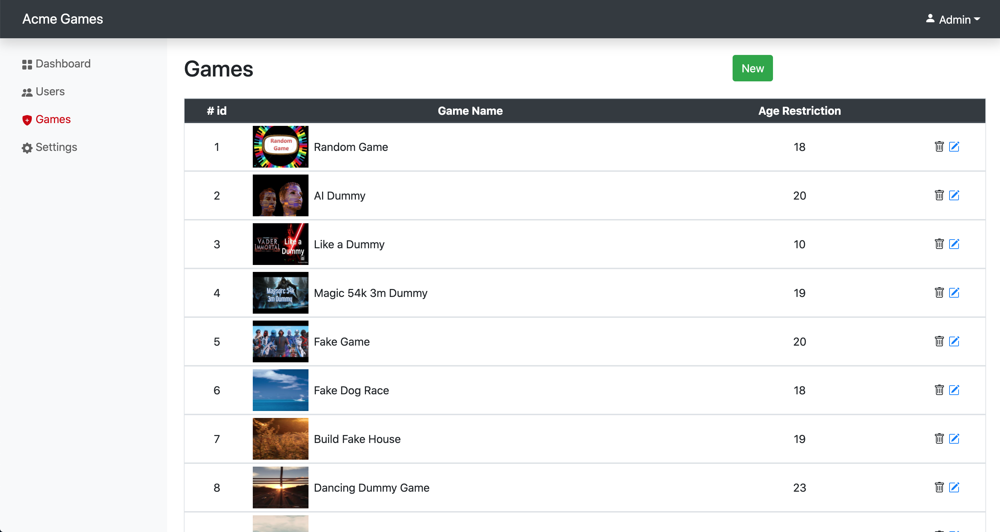

# Environment

### Build Version

I did not use vue-cli to setup project. Instead, I installed all dependencies and constructed build environment manually.

| Package | Version  |
| ------- | :------- |
| node    | v12.16.1 |
| vue     | v2.6     |
| webpack | v4.44.2  |
| babel   | v7.11.6  |

### CSS Frameworks

| Package       | Version |
| ------------- | :------ |
| bootstrap     | v4.5.2  |
| bootstrap-vue | v2.17.3 |

# How to Build

### Install

NOTE: Your node version requires at least v12.

```
npm run install
```

### Build (Production Only)

The following command generates all assets into **dist** folder. You can test this application by opening the created **index.html** file with an arbitrary browser. There is no user and game available in first use, and the admin user has already logged in to the admin interface.

```
npm run build
```

### Development

The following command runs a local server for development. You can test this application by accessing **http://0.0.0.0:8080/** file with an arbitrary browser. If your laptop is running the other application on the port **8080**, change the port defined in **package.json** at script.serve property with a specific port. You can test the application on a smartphone, if the smartphone is on the same network with your laptop. In that case, input the internal IP on your laptop and the port to the search box on the smartphone. You can also test this application via a mobile browser in iOS simulator, which is provided by Xcode. In the development mode, test user and game data has already exists.

```
npm run serve
```

### Staging

The following command runs a local server for staging. The difference between development and staging mode is dataset. In the staging mode, there is no user and game available in first use, and admin user has already logged in to the admin interface. As I use localstorage to store user, game and ownership data, you should clear cache the existing data before launch. This mode expects equivalent behaviours to the production build.

```
npm run serve:staging
```

### Unit Test

I have tested the only side menu item component and routing. The test framework that I used is jest framework.

```
npm run test
```

# Test Admin Account

This test admin account is defined in **<rootDir>/src/store/index.js**. Once sign out from this application, you can sign in with this admin account. Using admin account brings you to the admin interface. If you create a new user in the admin interface, you can sign in with the user account. Using the created user account leads to the user page. Initially, I thought multiple admin users used this admin interface. But at the moment, I provide just only one admin user to this admin user interface. Basically the admin user should not login with the same login form to user, but this assignment assume that admin user has already logged in to the admin interface. Therefore, temporary the admin can login to the interface with the same login form.

| Key      |        Value        |
| -------- | :-----------------: |
| email    | admin@acmegames.com |
| password |      acmegames      |

# Folder Structure

Main source code for development stores in **<rootDir>/src** directory.

```
.
├── README.md
├── designs
├── jest.config.js
├── node_modules
├── package-lock.json
├── package.json
├── src
└── webpack.config.js
```

# Browser Support

I checked the following browsers during development. This application supports mobile browsers as well as desktop ones.
| Browser | Version|
| ------- |----- |
| Chrome |v85.0.4183.121|
| Firefox |v81.0.1 |
| Safari |v13.1.2|
| Mobile Safari |iOS v13.4.1|
